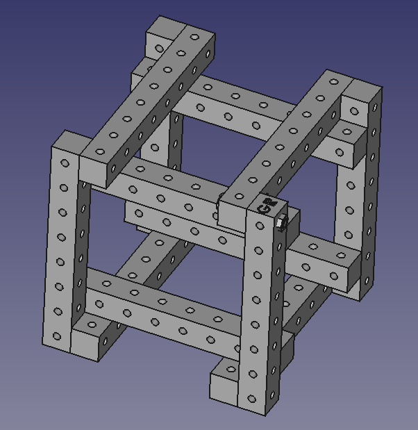

# OSE Developer Test
Programmatic solution to the [OSE Developer Test](https://wiki.opensourceecology.org/wiki/Developer_Test).

## Requirements
* Import 8 hole tubing from OSE Part Library and build a cube
* Fasten a bolt through one of the corners with a nut
* Pocket initials into any face of any tube



## Pre-Requisites
Download Tubing Library by running the following shell script:

```sh
./download-tubing-library.sh
```

This should create a `Tubing Library` directory inside the `ose-developer-test` directory.

## Import Macro into FreeCAD
Import `ose-developer-test.FCMacro` into FreeCAD.

## Dependencies
### FreeCAD Version Information
```
OS: Linux
Word size of OS: 64-bit
Word size of FreeCAD: 64-bit
Version: 0.18.16093 (Git)
Build type: Unknown
Branch: master
Hash: 690774c0effe4fd7b8d2b5e2fb2b8c8d145e21ce
Python version: 2.7.12
Qt version: 4.8.7
Coin version: 4.0.0a
OCC version: 7.0.0
Locale: English/UnitedStates (en_US)
```

### Fasteners Workbench
This macro depends on the [Fasteners Workbench](https://github.com/shaise/FreeCAD_FastenersWB) and was tested with commit [ab74422](https://github.com/shaise/FreeCAD_FastenersWB/commit/ab74422090ae7faf17f009d9b736a31de98875d3).